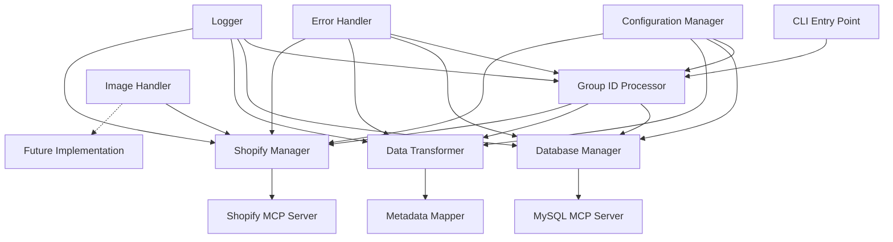
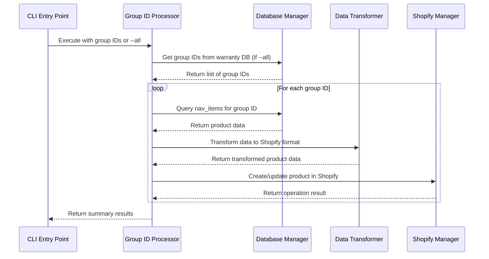
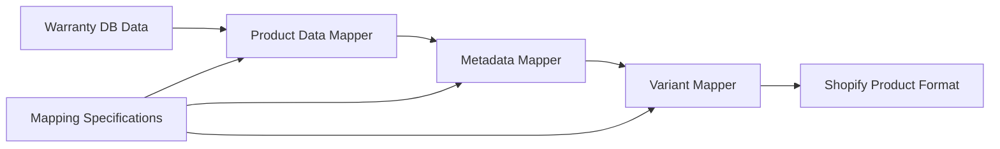
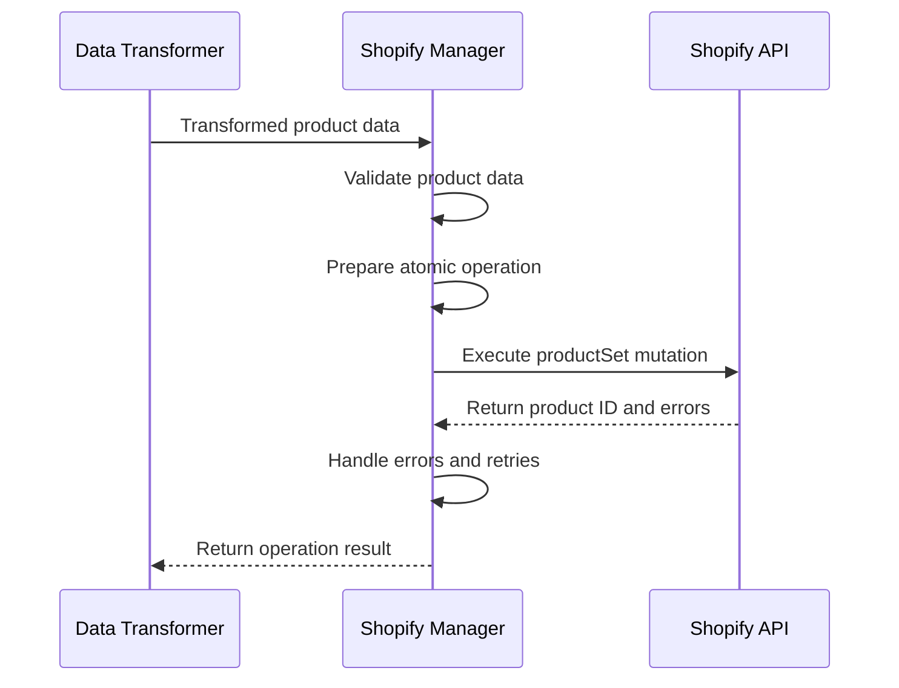

# Product Export System Specification
## Group ID to Shopify Product Integration

**Document Version**: 1.0  
**Date**: December 2024  
**Project**: Charles Colvard Product Export System  
**Target**: Shopify Admin API Integration  

---

## 📋 **Executive Summary**

This specification outlines a comprehensive Python-based system for exporting product data from the warranty database to Shopify using group IDs as the primary identifier. The system will process individual group IDs or all available group IDs, transform the data according to established mappings, and create/update products in Shopify using atomic operations to prevent product locking issues.

### **Key Features**
- Group ID-based product processing (e.g., GID-100968, LGD-102654)
- Atomic Shopify operations to prevent product locking
- Comprehensive error handling and retry mechanisms
- Configurable environment-based settings
- Modular architecture for maintainability
- Support for product images (placeholder for future implementation)
- Efficient batch processing for large datasets

---

## 🎯 **Requirements Overview**

### **Primary Requirements**
1. **Input Processing**: Accept list of group IDs or process all group IDs from warranty database
2. **Database Integration**: Connect to warranty database using MySQL MCP server
3. **Data Transformation**: Transform warranty database data to Shopify-compatible format
4. **Shopify Integration**: Create/update products using Shopify Admin API via MCP server
5. **Error Handling**: Robust error handling with retry mechanisms
6. **Configuration**: Environment-based configuration management
7. **Modularity**: Break functionality into smaller, maintainable files

### **Secondary Requirements**
1. **Performance**: Efficient processing with rate limiting compliance
2. **Monitoring**: Comprehensive logging and progress tracking
3. **Validation**: Data validation before Shopify submission
4. **Images**: Placeholder for future product image handling
5. **Dependencies**: Complete requirements.txt for easy installation

---

## 🏗️ **System Architecture**

### **High-Level Architecture**



### **Component Responsibilities**

| Component | Responsibility |
|-----------|----------------|
| **CLI Entry Point** | Command-line interface, argument parsing, main execution flow |
| **Group ID Processor** | Orchestrates the entire export process for group IDs |
| **Database Manager** | Handles warranty database connections and queries |
| **Data Transformer** | Transforms warranty data to Shopify format using mapping specs |
| **Shopify Manager** | Manages Shopify API interactions and product operations |
| **Configuration Manager** | Manages configuration files and environment variables |
| **Error Handler** | Centralized error handling and retry logic |
| **Logger** | Comprehensive logging and monitoring |
| **Image Handler** | Placeholder for future product image processing |

---

## 📊 **Data Flow Specification**

### **1. Input Processing Flow**



### **2. Data Transformation Flow**



### **3. Shopify Integration Flow**



---

## 🔧 **Technical Specifications**

### **1. Database Schema Integration**

#### **Primary Tables**
- **`nav_items`**: Main product information table
- **`nav_bom_components`**: Component-level details (stones, metals)

#### **Key Query Pattern**
```sql
-- Get all SKUs for a specific group ID
SELECT * FROM nav_items 
WHERE Web_Product_Group_ID = 'GID-100968';

-- Get component details for all SKUs in group
SELECT * FROM nav_bom_components 
WHERE Parent_Item_No_ IN (
    SELECT No_ FROM nav_items 
    WHERE Web_Product_Group_ID = 'GID-100968'
);
```

### **2. Data Mapping Specifications**

#### **Product-Level Attributes** (Consistent across group)
Based on `SHOPIFY_METADATA_SPECIFICATION.md`:

| Warranty DB Field | Shopify Field | Transformation |
|-------------------|---------------|----------------|
| `Item_Category_Code` | `product_type` | Title case conversion |
| `Product_Subgroup_Code` | `metafield.setting_style` | Code to description mapping |
| `Primary_Gem_Material_Type` | `metafield.stone_material` | Material type mapping |
| `Primary_Gem_Shape` | `metafield.stone_shape` | Shape standardization |
| `Primary_Gem_Color` | `metafield.stone_color` | Color standardization |
| `Metal_Stamp + Metal_Color` | `metafield.metal_type` | Metal type combination |

#### **Variant-Level Attributes** (Varies by SKU)
Based on product type analysis:

| Product Type | Primary Variations | Shopify Options |
|--------------|-------------------|-----------------|
| **RINGS** | Ring Size, Metal Type, Stone Weight | `option1`, `option2`, `option3` |
| **EARRINGS** | Metal Type, Stone Weight, Stone Length | `option1`, `option2`, `option3` |
| **NECKLACES** | Metal Type, Stone Weight, Plating Type | `option1`, `option2`, `option3` |
| **BRACELETS** | Metal Type, Stone Weight, Plating Type | `option1`, `option2`, `option3` |
| **GEMSTONES** | Stone Weight, Stone Length, Stone Width | `option1`, `option2`, `option3` |

### **3. Shopify API Integration**

#### **Atomic Operations**
Following `SHOPIFY_INTEGRATION_SPEC.md` best practices:

```graphql
mutation productSet($input: ProductSetInput!, $synchronous: Boolean!) {
    productSet(input: $input, synchronous: $synchronous) {
        product {
            id
            title
            handle
            status
            variants(first: 100) {
                nodes {
                    id
                    title
                    price
                    sku
                    selectedOptions {
                        name
                        value
                    }
                }
            }
            metafields(first: 50) {
                nodes {
                    id
                    namespace
                    key
                    value
                    type
                }
            }
        }
        userErrors {
            field
            message
            code
        }
    }
}
```

#### **Bulk Operations**
For large datasets (>10 products):
- Use `bulkOperationRunMutation` for efficiency
- Implement proper polling and error handling
- Respect Shopify's bulk operation limits

### **4. Error Handling & Retry Logic**

#### **Retry Strategy**
```python
class RetryHandler:
    def __init__(self, max_retries: int = 3, base_delay: float = 1.0):
        self.max_retries = max_retries
        self.base_delay = base_delay
    
    def execute_with_retry(self, operation, *args, **kwargs):
        for attempt in range(self.max_retries + 1):
            try:
                return operation(*args, **kwargs)
            except RateLimitError as e:
                if attempt == self.max_retries:
                    raise
                delay = self._calculate_delay(attempt, e.retry_after)
                time.sleep(delay)
            except TemporaryError as e:
                if attempt == self.max_retries:
                    raise
                delay = self._calculate_delay(attempt)
                time.sleep(delay)
```

#### **Error Categories**
- **Rate Limiting**: Automatic retry with exponential backoff
- **Product Locking**: Retry with longer delays
- **Validation Errors**: Fail fast with detailed messages
- **Network Errors**: Retry with exponential backoff
- **Data Errors**: Log and skip problematic records

---

## 📁 **Project Structure**

### **Directory Layout**
```
nav-videoshops-product-export/
├── src/
│   ├── __init__.py
│   ├── main.py                     # CLI entry point
│   ├── core/
│   │   ├── __init__.py
│   │   ├── group_id_processor.py   # Main orchestration logic
│   │   ├── database_manager.py     # Warranty DB interactions
│   │   ├── data_transformer.py     # Data mapping and transformation
│   │   ├── shopify_manager.py      # Shopify API interactions
│   │   └── image_handler.py        # Placeholder for image processing
│   ├── models/
│   │   ├── __init__.py
│   │   ├── product_data.py         # Data models
│   │   ├── variant_data.py         # Variant models
│   │   └── database_models.py      # DB response models
│   ├── utils/
│   │   ├── __init__.py
│   │   ├── config_manager.py       # Configuration management
│   │   ├── error_handler.py        # Error handling and retry logic
│   │   ├── logger.py              # Logging configuration
│   │   ├── validator.py           # Data validation
│   │   └── rate_limiter.py        # Rate limiting compliance
│   └── mapping/
│       ├── __init__.py
│       ├── product_mapper.py       # Product-level mapping logic
│       ├── variant_mapper.py       # Variant-level mapping logic
│       └── metadata_mapper.py      # Metadata mapping logic
├── config/
│   ├── config.yaml                 # Configuration file
│   ├── mapping_rules.yaml          # Data mapping rules
│   └── shopify_schemas.yaml        # Shopify field schemas
├── tests/
│   ├── __init__.py
│   ├── unit/
│   │   ├── test_group_id_processor.py
│   │   ├── test_data_transformer.py
│   │   ├── test_shopify_manager.py
│   │   └── test_validator.py
│   ├── integration/
│   │   ├── test_database_integration.py
│   │   └── test_shopify_integration.py
│   └── fixtures/
│       ├── sample_group_ids.txt
│       └── sample_product_data.json
├── docs/
│   ├── README.md
│   ├── INSTALLATION.md
│   ├── CONFIGURATION.md
│   └── API_REFERENCE.md
├── requirements.txt                # Python dependencies
├── setup.py                       # Package setup
├── .env.example                   # Environment variables example
└── .gitignore
```

### **Core Module Specifications**

#### **1. main.py - CLI Entry Point**
```python
"""
Main CLI entry point for the product export system.
Handles command-line arguments and orchestrates the export process.
"""

import argparse
import sys
from src.core.group_id_processor import GroupIDProcessor
from src.utils.config_manager import ConfigManager
from src.utils.logger import setup_logger

def main():
    parser = argparse.ArgumentParser(description='Export products from warranty DB to Shopify')
    parser.add_argument('group_ids', nargs='*', help='List of group IDs to process')
    parser.add_argument('--all', action='store_true', help='Process all group IDs from database')
    parser.add_argument('--config', default='config/config.yaml', help='Configuration file path')
    parser.add_argument('--dry-run', action='store_true', help='Validate data without creating products')
    parser.add_argument('--verbose', '-v', action='store_true', help='Verbose logging')
    
    args = parser.parse_args()
    
    # Setup logging
    logger = setup_logger(verbose=args.verbose)
    
    # Load configuration
    config = ConfigManager(args.config)
    
    # Initialize processor
    processor = GroupIDProcessor(config, logger)
    
    try:
        if args.all:
            result = processor.process_all_group_ids(dry_run=args.dry_run)
        else:
            if not args.group_ids:
                parser.error("Must provide group IDs or use --all flag")
            result = processor.process_group_ids(args.group_ids, dry_run=args.dry_run)
        
        # Print results
        print_summary(result)
        
    except Exception as e:
        logger.error(f"Export failed: {e}")
        sys.exit(1)
```

#### **2. core/group_id_processor.py - Main Orchestration**
```python
"""
Main orchestration class for processing group IDs.
Coordinates database queries, data transformation, and Shopify operations.
"""

from typing import List, Dict, Any, Optional
from dataclasses import dataclass
from src.core.database_manager import DatabaseManager
from src.core.data_transformer import DataTransformer
from src.core.shopify_manager import ShopifyManager
from src.utils.error_handler import ErrorHandler

@dataclass
class ProcessingResult:
    """Result of processing a group ID"""
    group_id: str
    success: bool
    product_id: Optional[str] = None
    error_message: Optional[str] = None
    variants_created: int = 0
    metafields_created: int = 0

class GroupIDProcessor:
    """Main processor for group ID export operations"""
    
    def __init__(self, config, logger):
        self.config = config
        self.logger = logger
        self.db_manager = DatabaseManager(config, logger)
        self.data_transformer = DataTransformer(config, logger)
        self.shopify_manager = ShopifyManager(config, logger)
        self.error_handler = ErrorHandler(config, logger)
    
    def process_group_ids(self, group_ids: List[str], dry_run: bool = False) -> List[ProcessingResult]:
        """Process a list of group IDs"""
        results = []
        
        for group_id in group_ids:
            try:
                result = self._process_single_group_id(group_id, dry_run)
                results.append(result)
            except Exception as e:
                error_result = ProcessingResult(
                    group_id=group_id,
                    success=False,
                    error_message=str(e)
                )
                results.append(error_result)
                self.logger.error(f"Failed to process {group_id}: {e}")
        
        return results
    
    def process_all_group_ids(self, dry_run: bool = False) -> List[ProcessingResult]:
        """Process all group IDs from the database"""
        group_ids = self.db_manager.get_all_group_ids()
        self.logger.info(f"Found {len(group_ids)} group IDs to process")
        return self.process_group_ids(group_ids, dry_run)
    
    def _process_single_group_id(self, group_id: str, dry_run: bool = False) -> ProcessingResult:
        """Process a single group ID"""
        self.logger.info(f"Processing group ID: {group_id}")
        
        # 1. Query database for group data
        group_data = self.db_manager.get_group_data(group_id)
        if not group_data:
            raise ValueError(f"No data found for group ID: {group_id}")
        
        # 2. Transform data to Shopify format
        shopify_data = self.data_transformer.transform_group_data(group_data)
        
        # 3. Validate transformed data
        validation_errors = self.data_transformer.validate_shopify_data(shopify_data)
        if validation_errors:
            raise ValueError(f"Data validation failed: {validation_errors}")
        
        if dry_run:
            return ProcessingResult(
                group_id=group_id,
                success=True,
                variants_created=len(shopify_data.get('variants', [])),
                metafields_created=len(shopify_data.get('metafields', []))
            )
        
        # 4. Create/update product in Shopify
        shopify_result = self.shopify_manager.create_or_update_product(shopify_data)
        
        return ProcessingResult(
            group_id=group_id,
            success=True,
            product_id=shopify_result.get('product_id'),
            variants_created=len(shopify_data.get('variants', [])),
            metafields_created=len(shopify_data.get('metafields', []))
        )
```

#### **3. core/database_manager.py - Database Integration**
```python
"""
Database manager for warranty database interactions.
Handles MySQL connections and queries using MCP server.
"""

from typing import List, Dict, Any, Optional
import mysql.connector
from src.utils.error_handler import ErrorHandler

class DatabaseManager:
    """Manages warranty database connections and queries"""
    
    def __init__(self, config, logger):
        self.config = config
        self.logger = logger
        self.error_handler = ErrorHandler(config, logger)
        self.connection = None
    
    def connect(self):
        """Establish database connection"""
        try:
            self.connection = mysql.connector.connect(
                host=self.config.database.host,
                port=self.config.database.port,
                user=self.config.database.user,
                password=self.config.database.password,
                database=self.config.database.name,
                autocommit=True
            )
            self.logger.info("Connected to warranty database")
        except Exception as e:
            self.logger.error(f"Database connection failed: {e}")
            raise
    
    def disconnect(self):
        """Close database connection"""
        if self.connection:
            self.connection.close()
            self.logger.info("Disconnected from warranty database")
    
    def get_all_group_ids(self) -> List[str]:
        """Get all unique group IDs from the database"""
        query = """
        SELECT DISTINCT Web_Product_Group_ID 
        FROM nav_items 
        WHERE Web_Product_Group_ID IS NOT NULL 
        AND Web_Product_Group_ID != ''
        ORDER BY Web_Product_Group_ID
        """
        
        return self._execute_query(query, fetch_all=True)
    
    def get_group_data(self, group_id: str) -> Optional[Dict[str, Any]]:
        """Get all data for a specific group ID"""
        # Get main product data
        product_query = """
        SELECT * FROM nav_items 
        WHERE Web_Product_Group_ID = %s
        """
        
        products = self._execute_query(product_query, (group_id,), fetch_all=True)
        if not products:
            return None
        
        # Get component data for all products in group
        product_nos = [product['No_'] for product in products]
        placeholders = ','.join(['%s'] * len(product_nos))
        
        component_query = f"""
        SELECT * FROM nav_bom_components 
        WHERE Parent_Item_No_ IN ({placeholders})
        ORDER BY Parent_Item_No_, RANK
        """
        
        components = self._execute_query(component_query, product_nos, fetch_all=True)
        
        return {
            'group_id': group_id,
            'products': products,
            'components': components
        }
    
    def _execute_query(self, query: str, params: tuple = None, fetch_all: bool = False):
        """Execute a database query with error handling"""
        if not self.connection:
            self.connect()
        
        try:
            cursor = self.connection.cursor(dictionary=True)
            cursor.execute(query, params)
            
            if fetch_all:
                return cursor.fetchall()
            else:
                return cursor.fetchone()
                
        except Exception as e:
            self.logger.error(f"Query execution failed: {e}")
            raise
        finally:
            if cursor:
                cursor.close()
```

#### **4. core/data_transformer.py - Data Transformation**
```python
"""
Data transformer for converting warranty database data to Shopify format.
Implements mapping rules from specification documents.
"""

from typing import List, Dict, Any, Optional
from src.mapping.product_mapper import ProductMapper
from src.mapping.variant_mapper import VariantMapper
from src.mapping.metadata_mapper import MetadataMapper

class DataTransformer:
    """Transforms warranty database data to Shopify-compatible format"""
    
    def __init__(self, config, logger):
        self.config = config
        self.logger = logger
        self.product_mapper = ProductMapper(config, logger)
        self.variant_mapper = VariantMapper(config, logger)
        self.metadata_mapper = MetadataMapper(config, logger)
    
    def transform_group_data(self, group_data: Dict[str, Any]) -> Dict[str, Any]:
        """Transform group data to Shopify product format"""
        group_id = group_data['group_id']
        products = group_data['products']
        components = group_data['components']
        
        # Group components by product
        components_by_product = {}
        for component in components:
            product_no = component['Parent_Item_No_']
            if product_no not in components_by_product:
                components_by_product[product_no] = []
            components_by_product[product_no].append(component)
        
        # Transform to Shopify format
        shopify_product = self.product_mapper.map_product(
            products[0], components_by_product.get(products[0]['No_'], [])
        )
        
        # Add variants for all products in group
        shopify_product['variants'] = []
        for product in products:
            variant = self.variant_mapper.map_variant(
                product, components_by_product.get(product['No_'], [])
            )
            shopify_product['variants'].append(variant)
        
        # Add metafields
        shopify_product['metafields'] = self.metadata_mapper.map_metafields(
            products[0], components_by_product.get(products[0]['No_'], [])
        )
        
        return shopify_product
    
    def validate_shopify_data(self, shopify_data: Dict[str, Any]) -> List[str]:
        """Validate transformed Shopify data"""
        errors = []
        
        # Validate required fields
        if not shopify_data.get('title'):
            errors.append("Product title is required")
        
        if not shopify_data.get('variants'):
            errors.append("At least one variant is required")
        
        # Validate variants
        for i, variant in enumerate(shopify_data.get('variants', [])):
            if not variant.get('sku'):
                errors.append(f"Variant {i}: SKU is required")
            
            if not variant.get('optionValues'):
                errors.append(f"Variant {i}: Option values are required")
        
        # Validate metafields
        for i, metafield in enumerate(shopify_data.get('metafields', [])):
            required_fields = ['namespace', 'key', 'type', 'value']
            for field in required_fields:
                if field not in metafield:
                    errors.append(f"Metafield {i}: {field} is required")
        
        return errors
```

#### **5. core/shopify_manager.py - Shopify Integration**
```python
"""
Shopify manager for API interactions.
Handles product creation, updates, and error management.
"""

from typing import Dict, Any, Optional
import requests
from src.utils.rate_limiter import RateLimiter
from src.utils.error_handler import ErrorHandler

class ShopifyManager:
    """Manages Shopify API interactions"""
    
    def __init__(self, config, logger):
        self.config = config
        self.logger = logger
        self.rate_limiter = RateLimiter(config)
        self.error_handler = ErrorHandler(config, logger)
        self.base_url = f"https://{config.shopify.shop_domain}/admin/api/{config.shopify.api_version}/graphql.json"
        self.headers = {
            'Content-Type': 'application/json',
            'X-Shopify-Access-Token': config.shopify.access_token
        }
    
    def create_or_update_product(self, product_data: Dict[str, Any]) -> Dict[str, Any]:
        """Create or update a product in Shopify using atomic operations"""
        self.rate_limiter.wait_if_needed()
        
        # Prepare GraphQL mutation
        mutation = self._prepare_product_set_mutation(product_data)
        
        # Execute with retry logic
        return self.error_handler.execute_with_retry(
            self._execute_graphql_mutation,
            mutation
        )
    
    def _prepare_product_set_mutation(self, product_data: Dict[str, Any]) -> Dict[str, Any]:
        """Prepare productSet mutation for atomic product creation"""
        mutation = """
        mutation productSet($input: ProductSetInput!, $synchronous: Boolean!) {
            productSet(input: $input, synchronous: $synchronous) {
                product {
                    id
                    title
                    handle
                    status
                    variants(first: 100) {
                        nodes {
                            id
                            title
                            price
                            sku
                            selectedOptions {
                                name
                                value
                            }
                        }
                    }
                    metafields(first: 50) {
                        nodes {
                            id
                            namespace
                            key
                            value
                            type
                        }
                    }
                }
                userErrors {
                    field
                    message
                    code
                }
            }
        }
        """
        
        variables = {
            "input": product_data,
            "synchronous": True
        }
        
        return {
            "query": mutation,
            "variables": variables
        }
    
    def _execute_graphql_mutation(self, mutation: Dict[str, Any]) -> Dict[str, Any]:
        """Execute GraphQL mutation"""
        response = requests.post(
            self.base_url,
            headers=self.headers,
            json=mutation,
            timeout=self.config.shopify.timeout
        )
        
        if response.status_code == 429:
            retry_after = int(response.headers.get('Retry-After', 2))
            raise RateLimitError(f"Rate limited. Retry after {retry_after} seconds", retry_after)
        
        response.raise_for_status()
        
        result = response.json()
        
        if result.get('errors'):
            raise Exception(f"GraphQL errors: {result['errors']}")
        
        return result['data']['productSet']
```

---

## ⚙️ **Configuration Management**

### **Configuration File Structure** (config/config.yaml)
```yaml
# Database Configuration
database:
  host: "${DB_HOST}"
  port: "${DB_PORT:3307}"
  user: "${DB_USER}"
  password: "${DB_PASSWORD}"
  name: "${DB_NAME:warranty}"

# Shopify Configuration
shopify:
  shop_domain: "${SHOPIFY_SHOP_DOMAIN}"
  access_token: "${SHOPIFY_ACCESS_TOKEN}"
  api_version: "${SHOPIFY_API_VERSION:2025-10}"
  timeout: "${SHOPIFY_TIMEOUT:30}"

# Processing Configuration
processing:
  max_retries: "${MAX_RETRIES:3}"
  retry_delay: "${RETRY_DELAY:1.0}"
  batch_size: "${BATCH_SIZE:10}"
  rate_limit_per_second: "${RATE_LIMIT_PER_SECOND:2}"

# Logging Configuration
logging:
  level: "${LOG_LEVEL:INFO}"
  file: "${LOG_FILE:logs/product_export.log}"
  max_size: "${LOG_MAX_SIZE:10MB}"
  backup_count: "${LOG_BACKUP_COUNT:5}"

# Image Processing (Placeholder)
images:
  enabled: false
  source_path: "${IMAGE_SOURCE_PATH:/images}"
  upload_method: "staged_upload"
```

### **Environment Variables** (.env.example)
```bash
# Database Configuration
DB_HOST=localhost
DB_PORT=3307
DB_USER=warranty_user
DB_PASSWORD=warranty_password
DB_NAME=warranty

# Shopify Configuration
SHOPIFY_SHOP_DOMAIN=your-shop.myshopify.com
SHOPIFY_ACCESS_TOKEN=your-access-token
SHOPIFY_API_VERSION=2025-10
SHOPIFY_TIMEOUT=30

# Processing Configuration
MAX_RETRIES=3
RETRY_DELAY=1.0
BATCH_SIZE=10
RATE_LIMIT_PER_SECOND=2

# Logging Configuration
LOG_LEVEL=INFO
LOG_FILE=logs/product_export.log
LOG_MAX_SIZE=10MB
LOG_BACKUP_COUNT=5

# Image Processing
IMAGE_SOURCE_PATH=/images
```

### **Configuration Manager Implementation**
```python
"""
Configuration manager for handling configuration files and environment variables.
"""

import os
import yaml
from typing import Any, Dict
from dataclasses import dataclass

@dataclass
class DatabaseConfig:
    host: str
    port: int
    user: str
    password: str
    name: str

@dataclass
class ShopifyConfig:
    shop_domain: str
    access_token: str
    api_version: str
    timeout: int

@dataclass
class ProcessingConfig:
    max_retries: int
    retry_delay: float
    batch_size: int
    rate_limit_per_second: int

@dataclass
class LoggingConfig:
    level: str
    file: str
    max_size: str
    backup_count: int

class ConfigManager:
    """Manages configuration from files and environment variables"""
    
    def __init__(self, config_file: str):
        self.config_file = config_file
        self._load_config()
    
    def _load_config(self):
        """Load configuration from file and environment variables"""
        with open(self.config_file, 'r') as f:
            config_data = yaml.safe_load(f)
        
        # Process environment variable substitution
        config_data = self._substitute_env_vars(config_data)
        
        # Create configuration objects
        self.database = DatabaseConfig(**config_data['database'])
        self.shopify = ShopifyConfig(**config_data['shopify'])
        self.processing = ProcessingConfig(**config_data['processing'])
        self.logging = LoggingConfig(**config_data['logging'])
    
    def _substitute_env_vars(self, data: Any) -> Any:
        """Recursively substitute environment variables in configuration"""
        if isinstance(data, dict):
            return {key: self._substitute_env_vars(value) for key, value in data.items()}
        elif isinstance(data, list):
            return [self._substitute_env_vars(item) for item in data]
        elif isinstance(data, str):
            return self._expand_env_vars(data)
        else:
            return data
    
    def _expand_env_vars(self, text: str) -> str:
        """Expand environment variables in text"""
        import re
        
        def replace_env_var(match):
            var_name = match.group(1)
            default_value = match.group(2) if match.group(2) else ''
            return os.getenv(var_name, default_value)
        
        # Pattern: ${VAR_NAME:default_value}
        pattern = r'\$\{([^:]+):?([^}]*)\}'
        return re.sub(pattern, replace_env_var, text)
```

---

## 📦 **Dependencies and Installation**

### **requirements.txt**
```txt
# Core Dependencies
requests>=2.31.0
PyYAML>=6.0
mysql-connector-python>=8.0.33

# Shopify Dependencies
shopify-python-api>=12.0.0

# Data Processing
pandas>=2.0.0
numpy>=1.24.0

# Utilities
python-dotenv>=1.0.0
click>=8.1.0
rich>=13.0.0

# Development Dependencies
pytest>=7.0.0
pytest-cov>=4.0.0
black>=23.0.0
flake8>=6.0.0
mypy>=1.0.0

# Logging and Monitoring
structlog>=23.0.0
```

### **setup.py**
```python
"""
Setup script for the product export system.
"""

from setuptools import setup, find_packages

with open("README.md", "r", encoding="utf-8") as fh:
    long_description = fh.read()

with open("requirements.txt", "r", encoding="utf-8") as fh:
    requirements = [line.strip() for line in fh if line.strip() and not line.startswith("#")]

setup(
    name="nav-videoshops-product-export",
    version="1.0.0",
    author="Charles Colvard",
    description="Product export system for warranty database to Shopify integration",
    long_description=long_description,
    long_description_content_type="text/markdown",
    packages=find_packages(where="src"),
    package_dir={"": "src"},
    classifiers=[
        "Development Status :: 4 - Beta",
        "Intended Audience :: Developers",
        "License :: OSI Approved :: MIT License",
        "Operating System :: OS Independent",
        "Programming Language :: Python :: 3",
        "Programming Language :: Python :: 3.8",
        "Programming Language :: Python :: 3.9",
        "Programming Language :: Python :: 3.10",
        "Programming Language :: Python :: 3.11",
    ],
    python_requires=">=3.8",
    install_requires=requirements,
    entry_points={
        "console_scripts": [
            "product-export=main:main",
        ],
    },
)
```

---

## 🧪 **Testing Strategy**

### **Unit Testing**
- **Group ID Processor**: Test orchestration logic
- **Data Transformer**: Test mapping and transformation logic
- **Shopify Manager**: Test API interactions (mocked)
- **Database Manager**: Test database queries (mocked)
- **Configuration Manager**: Test configuration loading

### **Integration Testing**
- **Database Integration**: Test real database connections
- **Shopify Integration**: Test with Shopify test store
- **End-to-End**: Test complete workflow with sample data

### **Performance Testing**
- **Batch Processing**: Test with large datasets
- **Rate Limiting**: Test rate limit compliance
- **Memory Usage**: Test memory efficiency with large datasets

### **Test Configuration**
```python
# tests/conftest.py
import pytest
from unittest.mock import Mock
from src.utils.config_manager import ConfigManager

@pytest.fixture
def mock_config():
    """Mock configuration for testing"""
    config = Mock()
    config.database.host = "localhost"
    config.database.port = 3307
    config.database.user = "test_user"
    config.database.password = "test_password"
    config.database.name = "test_db"
    
    config.shopify.shop_domain = "test-shop.myshopify.com"
    config.shopify.access_token = "test-token"
    config.shopify.api_version = "2025-10"
    config.shopify.timeout = 30
    
    config.processing.max_retries = 3
    config.processing.retry_delay = 1.0
    config.processing.batch_size = 10
    config.processing.rate_limit_per_second = 2
    
    return config

@pytest.fixture
def sample_group_data():
    """Sample group data for testing"""
    return {
        'group_id': 'GID-100968',
        'products': [
            {
                'No_': '1099145',
                'Item_Category_Code': 'RING',
                'Product_Subgroup_Code': '3STONEPLUS',
                'Metal_Stamp': '14K',
                'Metal_Color': 'WHITE',
                'Primary_Gem_Material_Type': 'MOISSANITE',
                'Primary_Gem_Shape': 'EMERALD',
                'Stone_Weight__Carats_': 3.87
            }
        ],
        'components': [
            {
                'Parent_Item_No_': '1099145',
                'RANK': 1,
                'Metal_Type': '0',
                'Primary_Gem_Shape': 'EMERALD',
                'Primary_Gem_Material_Type': 'MOISSANITE',
                'Stone_DEW__Carats_': 2.52,
                'Pieces_Per': 1,
                'Primary_Gem_Diameter_Length_MM': 9.0,
                'Primary_Gem_Width_MM': 7.0
            }
        ]
    }
```

---

## 📊 **Monitoring and Logging**

### **Logging Configuration**
```python
"""
Comprehensive logging configuration for the product export system.
"""

import logging
import logging.handlers
import sys
from typing import Optional

def setup_logger(verbose: bool = False, log_file: Optional[str] = None) -> logging.Logger:
    """Setup comprehensive logging configuration"""
    
    # Create logger
    logger = logging.getLogger('product_export')
    logger.setLevel(logging.DEBUG if verbose else logging.INFO)
    
    # Create formatter
    formatter = logging.Formatter(
        '%(asctime)s - %(name)s - %(levelname)s - %(message)s'
    )
    
    # Console handler
    console_handler = logging.StreamHandler(sys.stdout)
    console_handler.setLevel(logging.INFO if not verbose else logging.DEBUG)
    console_handler.setFormatter(formatter)
    logger.addHandler(console_handler)
    
    # File handler (if specified)
    if log_file:
        file_handler = logging.handlers.RotatingFileHandler(
            log_file,
            maxBytes=10*1024*1024,  # 10MB
            backupCount=5
        )
        file_handler.setLevel(logging.DEBUG)
        file_handler.setFormatter(formatter)
        logger.addHandler(file_handler)
    
    return logger
```

### **Performance Monitoring**
```python
"""
Performance monitoring for the product export system.
"""

import time
from typing import Dict, Any
from dataclasses import dataclass, field

@dataclass
class PerformanceMetrics:
    """Performance metrics for monitoring"""
    start_time: float = field(default_factory=time.time)
    total_products_processed: int = 0
    total_variants_created: int = 0
    total_metafields_created: int = 0
    total_errors: int = 0
    total_api_requests: int = 0
    total_rate_limit_hits: int = 0
    
    def get_summary(self) -> Dict[str, Any]:
        """Get performance summary"""
        duration = time.time() - self.start_time
        
        return {
            'duration_seconds': duration,
            'products_per_second': self.total_products_processed / duration if duration > 0 else 0,
            'variants_created': self.total_variants_created,
            'metafields_created': self.total_metafields_created,
            'error_rate': self.total_errors / max(self.total_products_processed, 1),
            'api_requests': self.total_api_requests,
            'rate_limit_hits': self.total_rate_limit_hits
        }
```

---

## 🚀 **Deployment and Usage**

### **Installation Instructions**
```bash
# Clone repository
git clone <repository-url>
cd nav-videoshops-product-export

# Install dependencies
pip install -r requirements.txt

# Setup configuration
cp .env.example .env
# Edit .env with your configuration

# Run tests
pytest

# Install package
pip install -e .
```

### **Usage Examples**

#### **Process Specific Group IDs**
```bash
# Process specific group IDs
product-export GID-100968 LGD-102654

# Process with verbose logging
product-export GID-100968 LGD-102654 --verbose

# Dry run (validate without creating products)
product-export GID-100968 LGD-102654 --dry-run
```

#### **Process All Group IDs**
```bash
# Process all group IDs from database
product-export --all

# Process all with custom configuration
product-export --all --config config/production.yaml
```

#### **Programmatic Usage**
```python
from src.core.group_id_processor import GroupIDProcessor
from src.utils.config_manager import ConfigManager
from src.utils.logger import setup_logger

# Setup
config = ConfigManager('config/config.yaml')
logger = setup_logger(verbose=True)
processor = GroupIDProcessor(config, logger)

# Process specific group IDs
results = processor.process_group_ids(['GID-100968', 'LGD-102654'])

# Process all group IDs
results = processor.process_all_group_ids()
```

---

## 🔒 **Security Considerations**

### **Credential Management**
- Environment variables for sensitive data
- Encrypted configuration files
- Secure token storage
- Access token rotation

### **API Security**
- HTTPS-only communications
- Rate limiting compliance
- Input validation and sanitization
- Error message sanitization

### **Data Protection**
- Secure database connections
- Encrypted data transmission
- Audit logging
- Access control

---

## 📈 **Performance Optimization**

### **Efficiency Measures**
- Atomic operations to prevent product locking
- Batch processing for large datasets
- Intelligent retry mechanisms
- Rate limiting compliance
- Connection pooling

### **Scalability Considerations**
- Horizontal scaling support
- Asynchronous processing capabilities
- Resource monitoring
- Performance metrics collection

---

## 🔮 **Future Enhancements**

### **Image Processing**
- Product image upload and management
- Image optimization and resizing
- Multiple image variants
- Image metadata extraction

### **Advanced Features**
- Real-time synchronization
- Webhook integration
- Advanced error recovery
- Performance analytics dashboard

### **Integration Extensions**
- Additional e-commerce platforms
- Inventory management integration
- Order processing integration
- Customer data synchronization

---

## 📋 **Implementation Checklist**

### **Phase 1: Core Implementation**
- [ ] Set up project structure
- [ ] Implement configuration management
- [ ] Create database manager
- [ ] Implement data transformer
- [ ] Create Shopify manager
- [ ] Add error handling and retry logic

### **Phase 2: Advanced Features**
- [ ] Implement group ID processor
- [ ] Add comprehensive logging
- [ ] Create CLI interface
- [ ] Implement data validation
- [ ] Add performance monitoring

### **Phase 3: Testing and Validation**
- [ ] Write unit tests
- [ ] Create integration tests
- [ ] Set up test data
- [ ] Validate with sample group IDs
- [ ] Performance testing

### **Phase 4: Deployment and Documentation**
- [ ] Create installation documentation
- [ ] Set up deployment scripts
- [ ] Create user guides
- [ ] Set up monitoring and alerting
- [ ] Production deployment

---

## 📞 **Support and Maintenance**

### **Monitoring**
- Real-time performance metrics
- Error rate tracking
- API usage monitoring
- Database performance monitoring

### **Maintenance Procedures**
- Regular dependency updates
- Security patch management
- Performance optimization
- Documentation updates

### **Troubleshooting Guide**
- Common error scenarios
- Debug procedures
- Recovery steps
- Escalation procedures

---

## 🔧 **Variant Mapping Implementation**

### **Intelligent Variant Generation**
The system now implements smart variant mapping that creates unique product variants based on actual database differences:

#### **Ring Products (Item_Category_Code: RING)**
- **Size Option**: Reads actual `Ring_Size` field from database
  - Example: Size 4.0, 4.5, 5.0, 5.5, 6.0, 6.5, 7.0, 7.5, 8.0, 8.5, 9.0
  - Format: Decimal with one decimal place (e.g., "5.0", "7.5")
- **Metal Option**: Combines `Metal_Stamp` and `Metal_Color` fields
  - Example: "14K Yellow Gold", "18K White Gold", "Platinum"
- **Stone Weight Option**: Uses `Stone_Weight__Carats_` field
  - Example: "0.30 CTW", "1.50 CTW", "2.00 CTW"

#### **Earring Products (Item_Category_Code: EARRING)**
- **Metal Option**: Primary metal type from database
- **Stone Weight Option**: Total carat weight from `Stone_Weight__Carats_`
- **Stone Length Option**: Uses `Primary_Gem_Diameter_Length_MM` field
  - Example: "5.0mm", "6.5mm", "8.0mm"

#### **Necklace/Bracelet Products**
- **Metal Option**: Primary metal type
- **Stone Weight Option**: Total carat weight
- **Plating Option**: Standard plating type (placeholder for future enhancement)

#### **Gemstone Products (Item_Category_Code: GEMSTONE)**
- **Stone Weight Option**: Individual stone weight
- **Stone Length Option**: Stone dimensions from `Primary_Gem_Diameter_Length_MM`
- **Stone Width Option**: Stone width from `Primary_Gem_Width_MM`

### **Variant Uniqueness**
- **Unique Combinations**: Each variant represents a unique combination of option values
- **No Duplicates**: System prevents duplicate variants with identical option combinations
- **Shopify Compliance**: All variants meet Shopify's product variant requirements

### **Example: Ring Product (LGD-101792)**
```
Product: 0.30 CTW Round Lab-Grown Diamond Accented Ring in 14K Yellow Gold
Variants: 11 unique combinations
- Size 4.0 + 14K Yellow Gold + 0.30 CTW
- Size 4.5 + 14K Yellow Gold + 0.30 CTW
- Size 5.0 + 14K Yellow Gold + 0.30 CTW
- ... (continues for all 11 sizes)
```

## 🔧 **Advanced Variant Logic Implementation**

### **Dynamic Variant Attributes**
The system now implements intelligent variant attribute detection that only includes attributes with multiple values:

#### **Ring Products (LGD-101792)**
- **Variant Attributes**: Only "Size" (since Metal Type and Carat Weight are identical across all variants)
- **Product Title**: "0.30 CTW Round Lab-Grown Diamond Accented Ring in 14K Yellow Gold"
- **Handle**: "030-ctw-round-lab-grown-diamond-accented-ring-in-14k-yellow-gold-lgd-101792"
- **Size Options**: 4.0, 4.5, 5.0, 5.5, 6.0, 6.5, 7.0, 7.5, 8.0, 8.5, 9.0 (sorted numerically)

#### **Necklace Products (GID-100288)**
- **Variant Attributes**: "Metal Type" and "Carat Weight" (Stone Size moved to metadata)
- **Product Title**: "Round Moissanite Solitaire Necklace" (excludes variant attributes)
- **Handle**: "round-moissanite-solitaire-necklace-gid-100288"
- **Metal Options**: 14K Rose Gold, 14K White Gold, 14K Yellow Gold, Platinum
- **Carat Weight Options**: 0.50 CTW, 1.00 CTW, 1.50 CTW, 1.90 CTW, 3.10 CTW, 3.27 CTW

#### **Earring Products (LGD-100040)**
- **Variant Attributes**: "Metal Type" and "Carat Weight"
- **Product Title**: "Round Lab-Grown Diamond Martini Earring" (excludes variant attributes)
- **Handle**: "round-lab-grown-diamond-martini-earring-lgd-100040"
- **Metal Options**: 14K Rose Gold, 14K White Gold, 14K Yellow Gold, 18K Rose Gold, 18K White Gold, 18K Yellow Gold, Platinum
- **Carat Weight Options**: 0.50 CTW, 1.00 CTW, 1.50 CTW, 2.00 CTW, 3.00 CTW, 4.00 CTW

### **Attribute Naming Conventions**
- **Metal Type**: Renamed from "Metal" to "Metal Type" for clarity
- **Carat Weight**: Renamed from "Stone Weight" to "Carat Weight" for industry standard
- **Stone Size**: Moved from variant attribute to metadata field for product details

### **Variant Attribute Ordering**
The system now implements a priority-based ordering for variant attributes:

1. **Carat Weight** (First Priority): Most important differentiating factor
2. **Metal Type** (Second Priority): Material selection
3. **Ring Size** (Last Priority): Physical sizing for rings

#### **Ordering Examples**:
- **Necklace**: `['Carat Weight:1.50 CTW', 'Metal Type:14K Yellow Gold']`
- **Earring**: `['Carat Weight:3.00 CTW', 'Metal Type:14K White Gold']`
- **Ring**: `['Size:5.0']` (only when Carat Weight and Metal Type are identical)

### **Custom Attribute Sorting**
The system implements intelligent sorting for variant attributes:

#### **Carat Weight Sorting**
- **Numeric Order**: Sorted by actual carat value (smallest to largest)
- **Example**: `['0.50 CTW', '1.00 CTW', '1.50 CTW', '2.00 CTW', '3.00 CTW', '4.00 CTW']`

#### **Metal Type Sorting**
- **Priority Order**: 14K Gold → Silver → Platinum → 18K Gold
- **Color Order**: White → Yellow → Rose (within each metal type)
- **Example**: `['14K White Gold', '14K Yellow Gold', '14K Rose Gold', 'Platinum', '18K White Gold', '18K Yellow Gold', '18K Rose Gold']`

#### **Ring Size Sorting**
- **Numeric Order**: Sorted by actual size value (smallest to largest)
- **Example**: `['4.0', '4.5', '5.0', '5.5', '6.0', '6.5', '7.0', '7.5', '8.0', '8.5', '9.0']`

### **Product Title Optimization**
- **Exclusion Logic**: Variant attributes are automatically excluded from product titles
- **Clean Titles**: Product titles focus on core product characteristics
- **Handle Generation**: Handles are generated from clean titles without variant attributes

### **Metadata Integration**
- **Stone Size**: Now stored as metadata (`custom.product_attributes.stone_size`)
- **Product Details**: Comprehensive metafields for product specifications
- **Variant Details**: Individual variant metafields for specific attributes

---

This specification provides a comprehensive blueprint for implementing the product export system. The modular architecture ensures maintainability, while the atomic operations approach prevents the product locking issues encountered in previous implementations. The system is designed to be efficient, scalable, and robust, with comprehensive error handling and monitoring capabilities.
