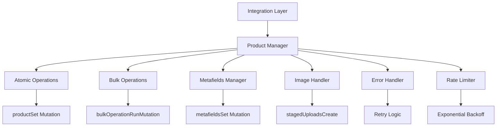

# Shopify Product Integration Specification

## 📋 Document Overview

This specification document outlines the best practices, architecture, and implementation details for building a robust Shopify product integration that avoids common pitfalls like product record locking, rate limiting issues, and data consistency problems.

**Version**: 1.0  
**Date**: 2024  
**Target Audience**: Development teams building Shopify integrations  
**Scope**: Product creation, updates, and bulk operations  

---

## 🎯 Executive Summary

### Problem Statement
Traditional Shopify integrations often suffer from:
- Product record locking during multi-step operations
- Rate limiting issues with high-volume operations
- Data consistency problems with partial failures
- Performance bottlenecks with large datasets
- Complex error recovery scenarios

### Solution Approach
This specification defines a comprehensive approach using:
- Atomic operations with `productSet` mutations
- Intelligent bulk operations for large datasets
- Robust error handling and retry mechanisms
- Efficient metafields management
- Rate limiting compliance

---

## 🏗️ Architecture Overview

### Core Principles

1. **Atomicity**: All related operations (product, variants, metafields, images) in single requests
2. **Idempotency**: Operations can be safely retried without side effects
3. **Resilience**: Graceful handling of failures with automatic recovery
4. **Scalability**: Support for both small and large datasets efficiently
5. **Observability**: Comprehensive logging and monitoring

### System Components



---

## 🔧 Technical Specifications

### 1. Core Data Models

#### ProductData Structure
```python
@dataclass
class ProductData:
    """Complete product representation with all related data"""
    # Core product fields
    title: str
    description: Optional[str] = None
    product_type: Optional[str] = None
    vendor: Optional[str] = None
    tags: Optional[List[str]] = None
    status: str = "ACTIVE"
    handle: Optional[str] = None
    
    # SEO fields
    seo_title: Optional[str] = None
    seo_description: Optional[str] = None
    
    # Product structure
    product_options: Optional[List[Dict[str, Any]]] = None
    variants: Optional[List[ProductVariant]] = None
    
    # Extended data
    metafields: Optional[List[Dict[str, Any]]] = None
    files: Optional[List[Dict[str, Any]]] = None
```

#### ProductVariant Structure
```python
@dataclass
class ProductVariant:
    """Product variant with all associated data"""
    option_values: List[Dict[str, str]]
    price: Optional[float] = None
    compare_at_price: Optional[float] = None
    sku: Optional[str] = None
    barcode: Optional[str] = None
    inventory_quantity: Optional[int] = None
    weight: Optional[float] = None
    weight_unit: str = "kg"
    
    # Variant-specific data
    metafields: Optional[List[Dict[str, Any]]] = None
    media_src: Optional[List[str]] = None
```

### 2. API Integration Patterns

#### Atomic Product Creation
```python
def create_product_atomically(product_data: ProductData) -> Dict:
    """
    Create product with all related data in single atomic operation.
    
    This is the RECOMMENDED approach to avoid product locking issues.
    """
    query = """
    mutation productSet($input: ProductSetInput!, $synchronous: Boolean!) {
        productSet(input: $input, synchronous: $synchronous) {
            product {
                id
                title
                handle
                status
                variants(first: 100) {
                    nodes {
                        id
                        title
                        price
                        sku
                        selectedOptions {
                            name
                            value
                        }
                    }
                }
                metafields(first: 50) {
                    nodes {
                        id
                        namespace
                        key
                        value
                        type
                    }
                }
            }
            userErrors {
                field
                message
                code
            }
        }
    }
    """
    
    variables = {
        "input": prepare_product_set_input(product_data),
        "synchronous": True  # Immediate results
    }
    
    return execute_graphql_request(query, variables)
```

#### Bulk Operations for Large Datasets
```python
def bulk_create_products(products: List[ProductData]) -> Dict:
    """
    Create multiple products using Shopify's bulk operations API.
    
    Use for datasets > 10 products to avoid rate limiting.
    """
    if len(products) <= 10:
        # Use individual atomic operations for small datasets
        return create_products_individually(products)
    
    # For large datasets, use bulk operations
    return execute_bulk_operation(products)

def execute_bulk_operation(products: List[ProductData]) -> Dict:
    """Execute bulk operation workflow"""
    # 1. Prepare JSONL file
    jsonl_data = prepare_jsonl_data(products)
    
    # 2. Upload to Shopify
    upload_result = upload_jsonl_file(jsonl_data)
    
    # 3. Start bulk operation
    operation_id = start_bulk_operation(upload_result['path'])
    
    # 4. Poll for completion
    return poll_bulk_operation(operation_id)
```

#### Metafields Management
```python
def add_metafields_batch(owner_id: str, metafields: List[Dict]) -> Dict:
    """
    Add metafields in batches to respect Shopify's 25-metafield limit.
    
    Args:
        owner_id: Product or variant ID
        metafields: List of metafield data (max 25 per batch)
    """
    batch_size = 25
    results = []
    
    for i in range(0, len(metafields), batch_size):
        batch = metafields[i:i + batch_size]
        
        # Add owner_id to each metafield
        for metafield in batch:
            metafield["ownerId"] = owner_id
        
        query = """
        mutation metafieldsSet($metafields: [MetafieldsSetInput!]!) {
            metafieldsSet(metafields: $metafields) {
                metafields {
                    id
                    namespace
                    key
                    value
                }
                userErrors {
                    field
                    message
                    code
                }
            }
        }
        """
        
        result = execute_graphql_request(query, {"metafields": batch})
        results.extend(result["metafieldsSet"]["metafields"])
        
        # Rate limiting delay
        if i + batch_size < len(metafields):
            time.sleep(0.5)
    
    return {"metafields": results}
```

### 3. Error Handling & Retry Logic

#### Exponential Backoff Implementation
```python
class RetryHandler:
    """Handles retries with exponential backoff and jitter"""
    
    def __init__(self, max_retries: int = 3, base_delay: float = 1.0):
        self.max_retries = max_retries
        self.base_delay = base_delay
    
    def execute_with_retry(self, operation, *args, **kwargs):
        """Execute operation with retry logic"""
        for attempt in range(self.max_retries + 1):
            try:
                return operation(*args, **kwargs)
            except RateLimitError as e:
                if attempt == self.max_retries:
                    raise
                
                delay = self._calculate_delay(attempt, e.retry_after)
                logger.warning(f"Rate limited. Retrying in {delay}s (attempt {attempt + 1})")
                time.sleep(delay)
                
            except TemporaryError as e:
                if attempt == self.max_retries:
                    raise
                
                delay = self._calculate_delay(attempt)
                logger.warning(f"Temporary error. Retrying in {delay}s (attempt {attempt + 1})")
                time.sleep(delay)
    
    def _calculate_delay(self, attempt: int, retry_after: Optional[int] = None) -> float:
        """Calculate delay with exponential backoff and jitter"""
        if retry_after:
            return float(retry_after)
        
        delay = self.base_delay * (2 ** attempt)
        jitter = random.uniform(0, 0.1) * delay
        return delay + jitter
```

#### Rate Limiting Compliance
```python
class RateLimiter:
    """Handles Shopify API rate limiting"""
    
    def __init__(self):
        self.requests_per_second = 2  # Conservative limit
        self.last_request_time = 0
    
    def wait_if_needed(self):
        """Ensure we don't exceed rate limits"""
        current_time = time.time()
        time_since_last = current_time - self.last_request_time
        
        if time_since_last < (1.0 / self.requests_per_second):
            sleep_time = (1.0 / self.requests_per_second) - time_since_last
            time.sleep(sleep_time)
        
        self.last_request_time = time.time()
    
    def handle_rate_limit_response(self, response):
        """Handle 429 responses with Retry-After header"""
        if response.status_code == 429:
            retry_after = int(response.headers.get('Retry-After', 2))
            logger.warning(f"Rate limited. Waiting {retry_after} seconds")
            time.sleep(retry_after)
            return True
        return False
```

### 4. Data Validation & Transformation

#### Input Validation
```python
class ProductValidator:
    """Validates product data before API submission"""
    
    def validate_product_data(self, product_data: ProductData) -> List[str]:
        """Validate product data and return list of errors"""
        errors = []
        
        # Required fields
        if not product_data.title or len(product_data.title.strip()) == 0:
            errors.append("Product title is required")
        
        if len(product_data.title) > 255:
            errors.append("Product title exceeds 255 characters")
        
        # Validate variants
        if product_data.variants:
            for i, variant in enumerate(product_data.variants):
                variant_errors = self._validate_variant(variant, i)
                errors.extend(variant_errors)
        
        # Validate metafields
        if product_data.metafields:
            metafield_errors = self._validate_metafields(product_data.metafields)
            errors.extend(metafield_errors)
        
        return errors
    
    def _validate_variant(self, variant: ProductVariant, index: int) -> List[str]:
        """Validate individual variant"""
        errors = []
        
        if not variant.option_values:
            errors.append(f"Variant {index}: option_values is required")
        
        if variant.price is not None and variant.price < 0:
            errors.append(f"Variant {index}: price cannot be negative")
        
        if variant.sku and len(variant.sku) > 255:
            errors.append(f"Variant {index}: SKU exceeds 255 characters")
        
        return errors
    
    def _validate_metafields(self, metafields: List[Dict]) -> List[str]:
        """Validate metafields structure"""
        errors = []
        
        for i, metafield in enumerate(metafields):
            required_fields = ['namespace', 'key', 'type', 'value']
            for field in required_fields:
                if field not in metafield:
                    errors.append(f"Metafield {i}: {field} is required")
        
        return errors
```

#### Data Transformation
```python
class DataTransformer:
    """Transforms data for Shopify API compatibility"""
    
    def prepare_product_set_input(self, product_data: ProductData) -> Dict:
        """Transform ProductData to Shopify API format"""
        input_data = {
            "title": product_data.title,
            "status": product_data.status
        }
        
        # Add optional fields with null checks
        if product_data.description:
            input_data["descriptionHtml"] = product_data.description
        
        if product_data.product_type:
            input_data["productType"] = product_data.product_type
        
        if product_data.vendor:
            input_data["vendor"] = product_data.vendor
        
        if product_data.tags:
            input_data["tags"] = product_data.tags
        
        # SEO fields
        if product_data.seo_title or product_data.seo_description:
            input_data["seo"] = {}
            if product_data.seo_title:
                input_data["seo"]["title"] = product_data.seo_title
            if product_data.seo_description:
                input_data["seo"]["description"] = product_data.seo_description
        
        # Product options
        if product_data.product_options:
            input_data["productOptions"] = product_data.product_options
        
        # Variants
        if product_data.variants:
            input_data["variants"] = [
                self._transform_variant(variant) 
                for variant in product_data.variants
            ]
        
        # Metafields
        if product_data.metafields:
            input_data["metafields"] = product_data.metafields
        
        # Files
        if product_data.files:
            input_data["files"] = product_data.files
        
        return input_data
    
    def _transform_variant(self, variant: ProductVariant) -> Dict:
        """Transform ProductVariant to Shopify API format"""
        variant_data = {
            "optionValues": variant.option_values
        }
        
        # Add optional fields
        if variant.price is not None:
            variant_data["price"] = str(variant.price)
        
        if variant.compare_at_price is not None:
            variant_data["compareAtPrice"] = str(variant.compare_at_price)
        
        if variant.sku:
            variant_data["sku"] = variant.sku
        
        if variant.barcode:
            variant_data["barcode"] = variant.barcode
        
        if variant.inventory_quantity is not None:
            variant_data["inventoryQuantity"] = variant.inventory_quantity
        
        if variant.weight is not None:
            variant_data["weight"] = variant.weight
            variant_data["weightUnit"] = variant.weight_unit
        
        if variant.metafields:
            variant_data["metafields"] = variant.metafields
        
        if variant.media_src:
            variant_data["mediaSrc"] = variant.media_src
        
        return variant_data
```

---

## 🚀 Implementation Guidelines

### 1. Project Structure
```
shopify_integration/
├── src/
│   ├── core/
│   │   ├── product_manager.py
│   │   ├── bulk_operations.py
│   │   └── metafields_manager.py
│   ├── models/
│   │   ├── product_data.py
│   │   └── variant_data.py
│   ├── utils/
│   │   ├── retry_handler.py
│   │   ├── rate_limiter.py
│   │   └── validator.py
│   └── config/
│       ├── settings.py
│       └── credentials.py
├── tests/
│   ├── unit/
│   ├── integration/
│   └── fixtures/
├── docs/
│   ├── api_reference.md
│   └── best_practices.md
└── examples/
    ├── basic_usage.py
    └── bulk_operations.py
```

### 2. Configuration Management
```python
# config/settings.py
from dataclasses import dataclass
from typing import Optional
import os

@dataclass
class ShopifyConfig:
    shop_domain: str
    access_token: str
    api_version: str = "2025-10"
    timeout: int = 30
    max_retries: int = 3
    retry_delay: float = 1.0
    bulk_operation_timeout: int = 3600  # 1 hour
    
    @classmethod
    def from_env(cls) -> 'ShopifyConfig':
        """Load configuration from environment variables"""
        return cls(
            shop_domain=os.getenv('SHOPIFY_SHOP_DOMAIN'),
            access_token=os.getenv('SHOPIFY_ACCESS_TOKEN'),
            api_version=os.getenv('SHOPIFY_API_VERSION', '2025-10'),
            timeout=int(os.getenv('SHOPIFY_TIMEOUT', '30')),
            max_retries=int(os.getenv('SHOPIFY_MAX_RETRIES', '3')),
            retry_delay=float(os.getenv('SHOPIFY_RETRY_DELAY', '1.0'))
        )
```

### 3. Logging & Monitoring
```python
# utils/monitoring.py
import logging
import time
from functools import wraps
from typing import Callable, Any

class PerformanceMonitor:
    """Monitors API performance and logs metrics"""
    
    def __init__(self, logger: logging.Logger):
        self.logger = logger
        self.metrics = {
            'total_requests': 0,
            'successful_requests': 0,
            'failed_requests': 0,
            'total_time': 0.0,
            'rate_limit_hits': 0
        }
    
    def track_request(self, func: Callable) -> Callable:
        """Decorator to track API request performance"""
        @wraps(func)
        def wrapper(*args, **kwargs):
            start_time = time.time()
            self.metrics['total_requests'] += 1
            
            try:
                result = func(*args, **kwargs)
                self.metrics['successful_requests'] += 1
                return result
            except Exception as e:
                self.metrics['failed_requests'] += 1
                if 'rate limit' in str(e).lower():
                    self.metrics['rate_limit_hits'] += 1
                raise
            finally:
                duration = time.time() - start_time
                self.metrics['total_time'] += duration
                
                self.logger.info(
                    f"API Request: {func.__name__} took {duration:.2f}s"
                )
        
        return wrapper
    
    def get_performance_summary(self) -> Dict[str, Any]:
        """Get performance metrics summary"""
        total_requests = self.metrics['total_requests']
        if total_requests == 0:
            return self.metrics
        
        return {
            **self.metrics,
            'success_rate': self.metrics['successful_requests'] / total_requests,
            'average_response_time': self.metrics['total_time'] / total_requests,
            'rate_limit_percentage': self.metrics['rate_limit_hits'] / total_requests
        }
```

### 4. Testing Strategy
```python
# tests/integration/test_product_creation.py
import pytest
from unittest.mock import Mock, patch
from src.core.product_manager import ProductManager
from src.models.product_data import ProductData, ProductVariant

class TestProductCreation:
    """Integration tests for product creation"""
    
    @pytest.fixture
    def product_manager(self):
        """Create product manager with mocked API"""
        config = ShopifyConfig(
            shop_domain="test-shop.myshopify.com",
            access_token="test-token"
        )
        return ProductManager(config)
    
    @pytest.fixture
    def sample_product_data(self):
        """Create sample product data for testing"""
        return ProductData(
            title="Test Product",
            description="Test description",
            variants=[
                ProductVariant(
                    option_values=[{"optionName": "Color", "name": "Red"}],
                    price=29.99,
                    sku="TEST-RED-001"
                )
            ],
            metafields=[
                {
                    "namespace": "test",
                    "key": "test_field",
                    "type": "single_line_text_field",
                    "value": "test_value"
                }
            ]
        )
    
    def test_atomic_product_creation(self, product_manager, sample_product_data):
        """Test atomic product creation"""
        with patch.object(product_manager, '_make_request') as mock_request:
            mock_request.return_value = {
                "productSet": {
                    "product": {
                        "id": "gid://shopify/Product/123",
                        "title": "Test Product"
                    },
                    "userErrors": []
                }
            }
            
            result = product_manager.create_product_with_variants(sample_product_data)
            
            assert result["id"] == "gid://shopify/Product/123"
            mock_request.assert_called_once()
    
    def test_metafields_batching(self, product_manager):
        """Test metafields are batched correctly"""
        metafields = [
            {"namespace": "test", "key": f"field_{i}", "type": "single_line_text_field", "value": f"value_{i}"}
            for i in range(30)  # More than 25 to test batching
        ]
        
        with patch.object(product_manager, '_make_request') as mock_request:
            mock_request.return_value = {
                "metafieldsSet": {
                    "metafields": [{"id": f"metafield_{i}"} for i in range(25)],
                    "userErrors": []
                }
            }
            
            product_manager.add_metafields_batch("gid://shopify/Product/123", metafields)
            
            # Should be called twice (25 + 5 metafields)
            assert mock_request.call_count == 2
    
    def test_rate_limit_handling(self, product_manager, sample_product_data):
        """Test rate limit handling"""
        from requests.exceptions import HTTPError
        
        with patch.object(product_manager, '_make_request') as mock_request:
            # First call returns rate limit error
            rate_limit_response = Mock()
            rate_limit_response.status_code = 429
            rate_limit_response.headers = {'Retry-After': '2'}
            
            mock_request.side_effect = [
                HTTPError(response=rate_limit_response),
                {
                    "productSet": {
                        "product": {"id": "gid://shopify/Product/123"},
                        "userErrors": []
                    }
                }
            ]
            
            result = product_manager.create_product_with_variants(sample_product_data)
            
            assert result["id"] == "gid://shopify/Product/123"
            assert mock_request.call_count == 2
```

---

## 📊 Performance Specifications

### 1. Throughput Requirements
- **Small datasets (< 10 products)**: Individual atomic operations
- **Medium datasets (10-100 products)**: Batched operations with delays
- **Large datasets (> 100 products)**: Bulk operations with async processing

### 2. Rate Limiting Compliance
- **Standard API**: 2 requests per second (conservative)
- **Bulk operations**: No rate limits, but 24-hour timeout
- **Metafields**: 25 per request maximum
- **Retry logic**: Exponential backoff with jitter

### 3. Error Handling Requirements
- **Transient errors**: Automatic retry with backoff
- **Rate limiting**: Respect Retry-After headers
- **Validation errors**: Fail fast with detailed messages
- **Network errors**: Retry with exponential backoff

### 4. Data Consistency
- **Atomic operations**: All-or-nothing for product creation
- **Idempotency**: Safe to retry operations
- **Rollback**: Graceful handling of partial failures
- **Validation**: Pre-flight validation of all data

---

## 🔒 Security Considerations

### 1. Credential Management
```python
# config/credentials.py
import os
from typing import Optional
from cryptography.fernet import Fernet

class CredentialManager:
    """Secure credential management"""
    
    def __init__(self, encryption_key: Optional[str] = None):
        self.encryption_key = encryption_key or os.getenv('ENCRYPTION_KEY')
        if self.encryption_key:
            self.cipher = Fernet(self.encryption_key.encode())
    
    def get_access_token(self) -> str:
        """Get access token from secure storage"""
        token = os.getenv('SHOPIFY_ACCESS_TOKEN')
        if not token:
            raise ValueError("SHOPIFY_ACCESS_TOKEN not found in environment")
        
        if self.encryption_key:
            return self.cipher.decrypt(token.encode()).decode()
        return token
    
    def encrypt_token(self, token: str) -> str:
        """Encrypt access token for storage"""
        if not self.encryption_key:
            raise ValueError("Encryption key not configured")
        return self.cipher.encrypt(token.encode()).decode()
```

### 2. API Security
- **HTTPS only**: All API communications over TLS
- **Token rotation**: Regular access token updates
- **Scope limiting**: Minimal required permissions
- **Audit logging**: All API calls logged securely

### 3. Data Protection
- **PII handling**: Secure handling of customer data
- **Data retention**: Automatic cleanup of temporary data
- **Encryption**: Sensitive data encrypted at rest
- **Access control**: Role-based access to integration

---

## 📈 Monitoring & Observability

### 1. Metrics Collection
```python
# utils/metrics.py
from dataclasses import dataclass
from typing import Dict, List
import time

@dataclass
class IntegrationMetrics:
    """Metrics for integration monitoring"""
    total_products_created: int = 0
    total_products_failed: int = 0
    total_api_requests: int = 0
    total_rate_limit_hits: int = 0
    average_response_time: float = 0.0
    error_rate: float = 0.0
    
    def calculate_error_rate(self) -> float:
        """Calculate error rate percentage"""
        total = self.total_products_created + self.total_products_failed
        if total == 0:
            return 0.0
        return (self.total_products_failed / total) * 100

class MetricsCollector:
    """Collects and reports integration metrics"""
    
    def __init__(self):
        self.metrics = IntegrationMetrics()
        self.start_time = time.time()
    
    def record_product_creation(self, success: bool, response_time: float):
        """Record product creation attempt"""
        if success:
            self.metrics.total_products_created += 1
        else:
            self.metrics.total_products_failed += 1
        
        self.metrics.total_api_requests += 1
        self._update_average_response_time(response_time)
    
    def record_rate_limit_hit(self):
        """Record rate limit hit"""
        self.metrics.total_rate_limit_hits += 1
    
    def get_health_status(self) -> Dict[str, Any]:
        """Get integration health status"""
        uptime = time.time() - self.start_time
        error_rate = self.metrics.calculate_error_rate()
        
        return {
            "status": "healthy" if error_rate < 5.0 else "degraded",
            "uptime_seconds": uptime,
            "error_rate_percentage": error_rate,
            "total_products_processed": (
                self.metrics.total_products_created + 
                self.metrics.total_products_failed
            ),
            "success_rate_percentage": 100 - error_rate,
            "rate_limit_hits": self.metrics.total_rate_limit_hits
        }
```

### 2. Alerting Configuration
```python
# monitoring/alerts.py
class AlertManager:
    """Manages integration alerts and notifications"""
    
    def __init__(self, webhook_url: str):
        self.webhook_url = webhook_url
    
    def check_error_rate(self, metrics: IntegrationMetrics):
        """Check if error rate exceeds threshold"""
        error_rate = metrics.calculate_error_rate()
        if error_rate > 10.0:  # 10% error rate threshold
            self.send_alert(
                "High Error Rate",
                f"Integration error rate is {error_rate:.1f}%"
            )
    
    def check_rate_limits(self, metrics: IntegrationMetrics):
        """Check if rate limits are being hit frequently"""
        if metrics.total_rate_limit_hits > 10:
            self.send_alert(
                "Frequent Rate Limiting",
                f"Rate limit hit {metrics.total_rate_limit_hits} times"
            )
    
    def send_alert(self, title: str, message: str):
        """Send alert notification"""
        # Implementation depends on alerting system
        pass
```

---

## 🧪 Testing Strategy

### 1. Unit Testing
```python
# tests/unit/test_product_manager.py
import pytest
from unittest.mock import Mock, patch
from src.core.product_manager import ProductManager

class TestProductManager:
    """Unit tests for ProductManager"""
    
    def test_retry_logic(self):
        """Test retry logic with exponential backoff"""
        # Test implementation
        pass
    
    def test_rate_limit_handling(self):
        """Test rate limit handling"""
        # Test implementation
        pass
    
    def test_data_validation(self):
        """Test data validation"""
        # Test implementation
        pass
```

### 2. Integration Testing
```python
# tests/integration/test_shopify_api.py
import pytest
from src.core.product_manager import ProductManager

class TestShopifyIntegration:
    """Integration tests with real Shopify API"""
    
    @pytest.mark.integration
    def test_real_product_creation(self):
        """Test with real Shopify API (requires test store)"""
        # Test implementation
        pass
    
    @pytest.mark.integration
    def test_bulk_operations(self):
        """Test bulk operations with real API"""
        # Test implementation
        pass
```

### 3. Performance Testing
```python
# tests/performance/test_throughput.py
import pytest
import time
from src.core.product_manager import ProductManager

class TestPerformance:
    """Performance tests for integration"""
    
    def test_throughput_benchmark(self):
        """Benchmark product creation throughput"""
        start_time = time.time()
        
        # Create 100 products
        products = [create_test_product() for _ in range(100)]
        results = product_manager.bulk_create_products(products)
        
        duration = time.time() - start_time
        throughput = len(products) / duration
        
        assert throughput > 1.0  # At least 1 product per second
        assert len(results) == len(products)
```

---

## 📚 Best Practices Summary

### ✅ DO's

1. **Use Atomic Operations**
   - Create products with variants, metafields, and images in single requests
   - Use `productSet` mutation for complete product creation

2. **Implement Proper Retry Logic**
   - Exponential backoff with jitter
   - Respect rate limiting headers
   - Handle transient errors gracefully

3. **Batch Operations Efficiently**
   - Use bulk operations for large datasets (>10 products)
   - Batch metafields in groups of 25
   - Add appropriate delays between batches

4. **Validate Data Before Submission**
   - Pre-validate all data structures
   - Check required fields and constraints
   - Transform data to API-compatible format

5. **Monitor and Log Everything**
   - Comprehensive logging of all operations
   - Performance metrics collection
   - Error tracking and alerting

### ❌ DON'Ts

1. **Don't Create Products Incrementally**
   ```python
   # BAD: Multiple separate requests
   product = create_product_basic()
   add_variants(product_id)
   add_metafields(product_id)
   upload_images(product_id)
   ```

2. **Don't Ignore Rate Limits**
   ```python
   # BAD: No rate limit handling
   for product in products:
       create_product(product)  # Will hit rate limits
   ```

3. **Don't Skip Error Handling**
   ```python
   # BAD: No error handling
   result = api_call()
   return result  # May fail silently
   ```

4. **Don't Process Large Datasets Synchronously**
   ```python
   # BAD: Synchronous processing of large datasets
   for product in large_product_list:
       create_product(product)  # Will timeout
   ```

---

## 🚀 Deployment Guidelines

### 1. Environment Setup
```bash
# Production environment variables
export SHOPIFY_SHOP_DOMAIN="your-shop.myshopify.com"
export SHOPIFY_ACCESS_TOKEN="your-access-token"
export SHOPIFY_API_VERSION="2025-10"
export SHOPIFY_TIMEOUT="30"
export SHOPIFY_MAX_RETRIES="3"
export ENCRYPTION_KEY="your-encryption-key"
```

### 2. Docker Configuration
```dockerfile
# Dockerfile
FROM python:3.11-slim

WORKDIR /app

COPY requirements.txt .
RUN pip install -r requirements.txt

COPY src/ ./src/
COPY config/ ./config/

CMD ["python", "-m", "src.main"]
```

### 3. Kubernetes Deployment
```yaml
# k8s-deployment.yaml
apiVersion: apps/v1
kind: Deployment
metadata:
  name: shopify-integration
spec:
  replicas: 3
  selector:
    matchLabels:
      app: shopify-integration
  template:
    metadata:
      labels:
        app: shopify-integration
    spec:
      containers:
      - name: shopify-integration
        image: shopify-integration:latest
        env:
        - name: SHOPIFY_SHOP_DOMAIN
          valueFrom:
            secretKeyRef:
              name: shopify-secrets
              key: shop-domain
        - name: SHOPIFY_ACCESS_TOKEN
          valueFrom:
            secretKeyRef:
              name: shopify-secrets
              key: access-token
        resources:
          requests:
            memory: "256Mi"
            cpu: "250m"
          limits:
            memory: "512Mi"
            cpu: "500m"
```

---

## 📋 Implementation Checklist

### Phase 1: Core Implementation
- [ ] Set up project structure
- [ ] Implement ProductData and ProductVariant models
- [ ] Create ProductManager with atomic operations
- [ ] Implement retry logic and rate limiting
- [ ] Add comprehensive logging

### Phase 2: Advanced Features
- [ ] Implement bulk operations
- [ ] Add metafields management
- [ ] Create image upload handling
- [ ] Implement data validation
- [ ] Add performance monitoring

### Phase 3: Testing & Deployment
- [ ] Write unit tests
- [ ] Create integration tests
- [ ] Set up performance testing
- [ ] Configure monitoring and alerting
- [ ] Deploy to production

### Phase 4: Optimization
- [ ] Performance tuning
- [ ] Error rate optimization
- [ ] Cost optimization
- [ ] Documentation updates
- [ ] Team training

---

## 📞 Support & Maintenance

### 1. Monitoring Dashboard
- Real-time metrics display
- Error rate tracking
- Performance monitoring
- Alert notifications

### 2. Maintenance Procedures
- Regular dependency updates
- Security patch management
- Performance optimization
- Documentation updates

### 3. Troubleshooting Guide
- Common error scenarios
- Debug procedures
- Recovery steps
- Escalation procedures

---

This specification provides a comprehensive blueprint for building a robust Shopify product integration that avoids common pitfalls and follows best practices. The implementation should be adapted to your specific requirements and constraints.
